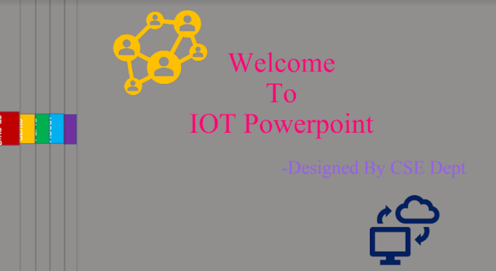
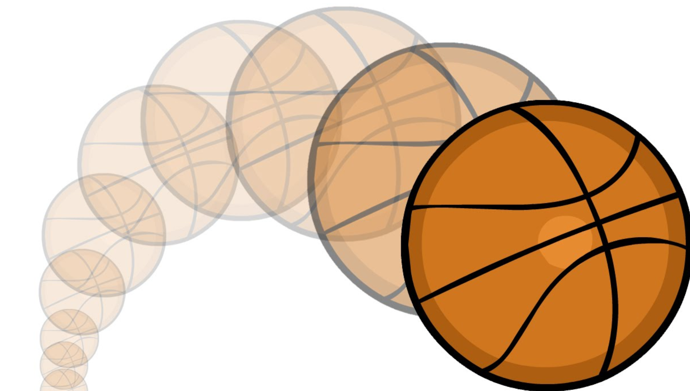

<html data_liveedit_tagid="000000002E445C30">
<head data_liveedit_tagid="00000000141573A0">
<meta charset="utf-8" data_liveedit_tagid="000000001B18B310">
<meta http-equiv="X-UA-Compatible" content="IE=edge" data_liveedit_tagid="000000001B18A160">
<meta name="viewport" content="width=device-width, initial-scale=1" data_liveedit_tagid="000000001AE002C0">
<title data_liveedit_tagid="000000001B18D400">Multimediaproject</title>
<link href="./simpleGridTemplate.css" rel="stylesheet" type="text/css" data_liveedit_tagid="000000001B6ECB20">
</head>
<body style="background: rgba(99,45,193,1.00)" data_liveedit_tagid="000000001B18D790">
<!-- Main Container -->

 
  <!-- Header -->
  <header class="header" data_liveedit_tagid="000000002E44C9D0">
    <h4 class="logo" data_liveedit_tagid="00000000141552B0">What's Multimedia?</h4>
  </header>
  <!-- Hero Section -->
  <section class="intro" data_liveedit_tagid="000000002E44D0D0">
    

      <h3 data_liveedit_tagid="000000002E44DA30">Let' have a look at it..</h3>
       

    

      
Multimedia is content that uses a combination of different content forms such as text, audio, images, animations, video and interactive content. Multimedia contrasts with media that use only rudimentary computer displays such as text-only or traditional forms of printed or hand-produced material. 

      
Multimedia can be recorded and played, displayed, interacted with or accessed by information content processing devices, such as computerized and electronic devices, but can also be part of a live performance. Multimedia devices are electronic media devices used to store and experience multimedia content. Multimedia is distinguished from mixed media in fine art; for example, by including audio it has a broader scope. In the early years of multimedia the term "rich media" was synonymous with interactive multimedia, and "hypermedia" was an application of multimedia.

		<ul class="section-btn" data_liveedit_tagid="000000002E44C510">
                              <a href="#Gallery" class="smoothScroll" data_liveedit_tagid="000000002E44EF60">Discover More</a>
                         </ul>
    

  </section>
  <!-- Stats Gallery Section -->
	<section id="Gallery" data_liveedit_tagid="0000000014156800">
       

          
 
      <h4 data_liveedit_tagid="000000002E44BCE0">Word editor</h4>
      
Microsoft word

      
Making a logo.

    

		
 
      <h4 data_liveedit_tagid="000000002E44C2D0">Power point</h4>
      
Microsoft Powepoint

      
Creating animation in powerpoint of iot project.

    

    
 
      <h4 data_liveedit_tagid="000000002E44CC30">Poster</h4>
      
Microsoft word

      
Making a postor for iot workshop.

    

    
 
      <h4 data_liveedit_tagid="000000002E44E390">Image changing</h4>
      
Adobe Photoshop

      
Inserting to images as one.

    

    
 
      <h4 data_liveedit_tagid="000000002E44AC50">Different layer of images</h4>
      
Adobe photoshop

      
Adding Smoke effect to image.

    

    
 
      <h4 data_liveedit_tagid="0000000014157850">Bouncing ball using flash</h4>
      
Flash editor

      
Creating animation of bouncing ball.

    

    
 
      <h4 data_liveedit_tagid="000000001414C1E0">Clouds moving using flash</h4>
      
Flash editor

      
Creating animation of passing clouds.

    

    
 
      <h4 data_liveedit_tagid="000000001B1BE010">Birds flying using flash</h4>
      
Flash editor

      
Creating animation of flying bird.

    

	   
 
      <h4 data_liveedit_tagid="000000002E44E840">Personal Blog</h4>
      
Abode Dreamweaver

      
Creating personal blog using dreamweaver.

    
  
    

	</section>
  <!-- Footer Section -->
  

    
GET IN TOUCH WITH ME

    
EMAIL ME 

	  

	  
  <!-- Copyrights Section -->
  
&copy;2019 - <strong data_liveedit_tagid="000000002E4458D0">All copy rights received.</strong>

<!-- Main Container Ends -->
	

	

  <dw-container-div>

	  
